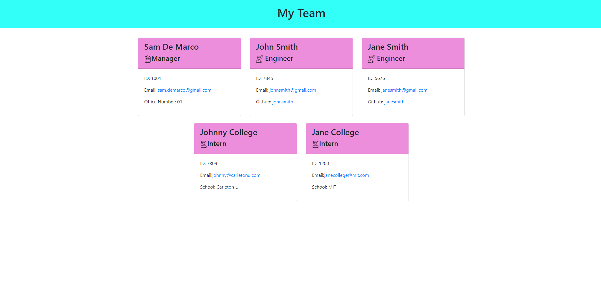

<h1>10 Object-Oriented Programming: Team Profile Generator</h1>
  
  <br />
  
  Here is a snapshot of final HTML product after launching the application:


## Video Link

Link to Screencastify/Castify Video of application in action: https://app.castify.com/view/9001dc4e-72d7-46f9-b5ab-dc98a8d53102
  
  ## Description
   A Node.js command-line application that takes in information about employees on a software engineering team, then generates an HTML webpage that displays summaries    for each person. 
   
   ## Challenges

Definitely encountered a few challenges on this project. One challenge I struggled with was visualizing how I would take data generated via Inquirer npm package  
which was placed into an array, and then convert to an actual HTML page by leveraging a separate JavaScript file (htmlRender.js). I tried my best to try and simplify the process by just passing the array (inquirer prompt data) directly to the 'htmlRender' function which then just parses the data to determine employee role and generate the corresponding HTML, and then using 'fs.write' to create my page.

## User Story

```
AS A manager
I WANT to generate a webpage that displays my team's basic info
SO THAT I have quick access to their emails and GitHub profiles

```

## Acceptance Criteria

```
GIVEN a command-line application that accepts user input
WHEN I am prompted for my team members and their information
THEN an HTML file is generated that displays a nicely formatted team roster based on user input
WHEN I click on an email address in the HTML
THEN my default email program opens and populates the TO field of the email with the address
WHEN I click on the GitHub username
THEN that GitHub profile opens in a new tab
WHEN I start the application
THEN I am prompted to enter the team manager’s name, employee ID, email address, and office number
WHEN I enter the team manager’s name, employee ID, email address, and office number
THEN I am presented with a menu with the option to add an engineer or an intern or to finish building my team
WHEN I select the engineer option
THEN I am prompted to enter the engineer’s name, ID, email, and GitHub username, and I am taken back to the menu
WHEN I select the intern option
THEN I am prompted to enter the intern’s name, ID, email, and school, and I am taken back to the menu
WHEN I decide to finish building my team
THEN I exit the application, and the HTML is generated

```
   
  ## Table of Contents
  - [Description](#description)
  - [Installation](#installation)
  - [Usage](#usage)
  - [License](#license)
  - [Contributors](#contributors)
  - [Tests](#tests)
  - [Questions](#questions)
  ## Installation
   The applications requires npm install along with the Inquirer, fs, and jest packages. User then launches the application via CLI using command ```node index.js```
  ## Usage
   Quickly and easily generate a clean looking HTML page with team members and their pertinent information based on their role.
  ## License
  
  <br />
  MIT License URL:   https://opensource.org/licenses/MIT. 
  ## Contributors
   Sam De Marco
  ## Tests
   There are 4 tests in this project for the following JavaScript files/classes: Employee, Manager, Engineer, and Intern. The tests are invoked via 'jest' command. Ex:   "jest .\Employee.test.js" 
  ## Questions
   Email<br />
  <br />
  My GitHub: [Samdemarco](https://github.com/Samdemarco)

  Contact me via email for any issues: sam.demarco@gmail.com<br /><br />
  
